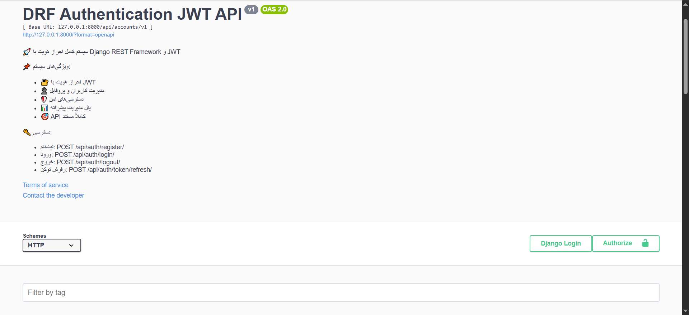
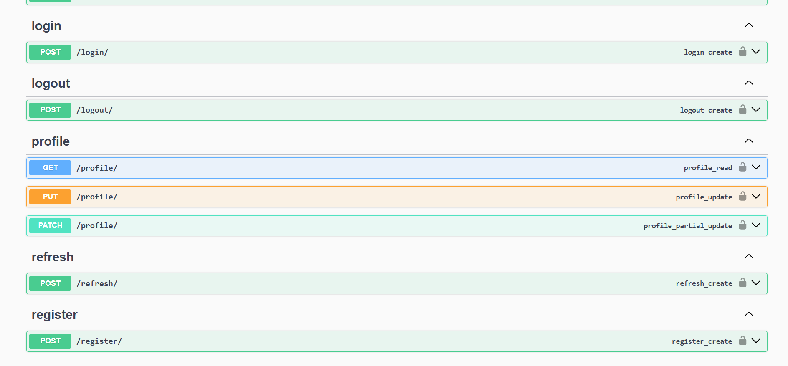
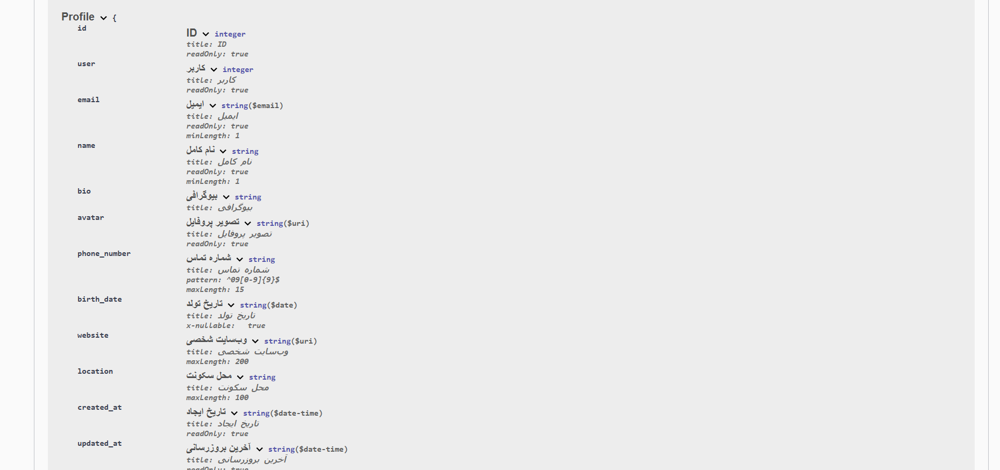

# مستندات پروژه - سیستم احراز هویت JWT با تشخیص دستگاه و CSRF

## فهرست مطالب
- [معرفی (فارسی)](#معرفی-فارسی)
- [ویژگی‌ها (فارسی)](#ویژگیها-فارسی)
- [معماری (فارسی)](#معماری-فارسی)
- [پیش‌نیازها و نصب (فارسی)](#پیشنیازها-و-نصب-فارسی)
- [اندپوینت‌های API (فارسی)](#اندپوینتهای-api-فارسی)
- [ملاحظات امنیتی (فارسی)](#ملاحظات-امنیتی-فارسی)
- [تشکر و قدردانی (فارسی)](#تشکر-و-قدردانی-فارسی)
- [Introduction (English)](#introduction-english)
- [Features (English)](#features-english)
- [Architecture (English)](#architecture-english)
- [Prerequisites & Setup (English)](#prerequisites--setup-english)
- [API Endpoints (English)](#api-endpoints-english)
- [Security Considerations (English)](#security-considerations-english)
- [Acknowledgments (English)](#acknowledgments-english)

---


###  شمای کلی پروژه و  مسیر ها


*شمای مدل Profile



## معرفی (فارسی)

این پروژه یک سیستم احراز هویت کامل و امن برای APIهای مبتنی بر Django REST Framework است که از JSON Web Tokens (JWT) با قابلیت تشخیص نوع دستگاه کاربر (کامپیوتر یا موبایل) استفاده می‌کند.  
بسته به نوع دستگاه، توکن‌ها در کوکی‌های `HttpOnly` (برای مرورگرهای دسکتاپ) یا به‌صورت کلاسیک در هدر `Authorization` (برای اپلیکیشن‌های موبایل) منتقل می‌شوند. همزمان محافظت CSRF برای کلاینت‌های وب فعال است.  
این راهکار با بهره‌گیری از کتابخانه‌های رسمی `djangorestframework-simplejwt` و سازوکار CSRF جنگو پیاده‌سازی شده و آماده استفاده در محیط‌های پروداکشن می‌باشد.

### توسعه‌دهنده
- **ایمیل:** moeinrezaie516@gmail.com  
- **نام پروژه:** DRF JWT Authentication with Device Detection & CSRF

### راهنمایی و همکاری
در فرایند طراحی و توسعه این پروژه از راهنمایی‌ها و کمک‌های فنی مهندس علی بیگدلی (مدرس و مشاور) استفاده شده است. همچنین برای بهبود سرعت در بازنویسی (رفکتور) و افزایش دقت برخی بخش‌ها، از ابزارهای هوش مصنوعی به صورت محدود کمک گرفته شده است.

---

## ویژگی‌ها (فارسی)
- **احراز هویت دوگانه بر اساس دستگاه:**  
  - مرورگرهای دسکتاپ: توکن‌ها در کوکی‌های امن `HttpOnly`, `Secure`, `SameSite=Lax` قرار می‌گیرند.  
  - موبایل/تبلت: توکن‌ها به صورت کلاسیک از طریق هدر `Authorization: Bearer <token>` و بدنه JSON دریافت و ارسال می‌شوند.
- **محافظت CSRF یکپارچه:**  
  میدلور تشخیص دستگاه، برای کلاینت‌های موبایل بررسی CSRF را غیرفعال می‌کند و برای وب، الزام به ارسال هدر `X-CSRFToken` را حفظ می‌کند.
- **چرخش خودکار Refresh Token و بلاک‌لیست:**  
  با هر بار تمدید توکن، یک `refresh` جدید صادر و توکن قبلی به صورت خودکار بلاک‌لیست می‌شود (با استفاده از `ROTATE_REFRESH_TOKENS` و `BLACKLIST_AFTER_ROTATION`).
- **خروج امن و بلاک‌لیست دستی:**  
  امکان بلاک‌لیست کردن دستی توکن در زمان خروج کاربر.
- **بلاک‌لیست کامل توکن‌های کاربر:**  
  هنگام تغییر رمز عبور یا دیگر رخدادهای حساس، تمامی توکن‌های معتبر کاربر باطل می‌شوند.
- **مدیریت کاربری پیشرفته:**  
  شامل ثبت‌نام، ورود، تغییر رمز عبور، فراموشی و بازیابی رمز عبور، مشاهده و ویرایش پروفایل.
- **سطوح دسترسی انعطاف‌پذیر:**  
  گروه‌ها و مجوزهای سفارشی (admin, support, custom admin و ...).
- **API مستندسازی شده:**  
  استفاده از Swagger (drf-yasg) و/یا drf-spectacular برای نمایش اندپوینت‌ها.
- **آماده برای محیط‌های Docker:**  
  تنظیمات کامل جهت اجرا با Docker و Docker Compose.

---

## معماری (فارسی)

### ساختار پروژه
```
core_project/
├── config/                 # تنظیمات اصلی پروژه (settings, urls, wsgi)
├── accounts/               # اپلیکیشن اصلی احراز هویت
│   ├── models.py           # مدل User (CustomUser) و Profile
│   ├── managers.py         # UserManager سفارشی
│   ├── signals.py          # سیگنال‌های ساخت پروفایل و بلاک‌لیست توکن‌ها
│   ├── middleware.py       # میدلور تشخیص نوع دستگاه
│   └── api/v1/
│       ├── urls.py         # مسیرهای API نسخه ۱
│       ├── views.py        # ویوهای اصلی (Login, Register, Refresh, ...)
│       ├── serializers.py  # سریالایزرهای ورودی/خروجی
│       ├── authentication.py # کلاس احراز هویت سفارشی JWT
│       ├── permissions.py  # سطوح دسترسی (Admin, Support, ...)
│       └── utils.py        # توابع کمکی (ایمیل، blacklist)
└── Dockerfile / docker-compose.yml
```

### جریان کلی
1. **میدلور DeviceDetectionMiddleware** در ابتدای هر درخواست، `User-Agent` را تحلیل کرده و `request.device_type` را برابر `'web'` یا `'mobile'` قرار می‌دهد.  
2. **کلاس احراز هویت سفارشی** (`CookieOrHeaderJWTAuthentication`) بر اساس این نوع دستگاه، توکن `access` را از کوکی یا هدر `Authorization` استخراج می‌کند.  
3. **ویوهای ورود/ثبت‌نام** پس از تولید توکن، در صورت وب بودن کاربر، توکن‌ها را در کوکی‌های `HttpOnly` تنظیم می‌کنند و در غیر این صورت در بدنه JSON برمی‌گردانند.  
4. **ویو تمدید توکن** توکن قبلی را (با توجه به تنظیمات) بلاک‌لیست کرده و یک جفت توکن جدید ایجاد می‌کند.  
5. **سیگنال‌ها** به‌طور خودکار پروفایل کاربر را ایجاد کرده و هنگام تغییر رمز عبور، تمام توکن‌های معتبر کاربر را باطل می‌کنند.

---

## پیش‌نیازها و نصب (فارسی)

### پیش‌نیازها
- Python 3.10+
- pip
- Docker (اختیاری)

### راه‌اندازی
1. پروژه را Clone کنید.
2. یک محیط مجازی بسازید و فعال کنید.
3. وابستگی‌ها را نصب کنید:
   ```bash
   pip install -r requirements.txt
   ```
4. مهاجرت‌ها را اجرا کنید:
   ```bash
   python manage.py migrate
   ```
5. یک ابرکاربر بسازید:
   ```bash
   python manage.py createsuperuser
   ```
6. سرور توسعه را اجرا کنید:
   ```bash
   python manage.py runserver
   ```
   (برای اجرا با Docker: `docker-compose up --build`)

---

## اندپوینت‌های API (فارسی)
همه مسیرها تحت `/api/auth/` در دسترس هستند.

| روش   | مسیر                | توضیح                                | نیاز به احراز |
|-------|---------------------|--------------------------------------|---------------|
| GET   | `/csrf/`            | دریافت کوکی CSRF                     | خیر           |
| POST  | `/register/`        | ثبت‌نام کاربر جدید و دریافت توکن     | خیر           |
| POST  | `/login/`           | ورود و دریافت توکن                   | خیر           |
| POST  | `/logout/`          | خروج و بلاک‌لیست توکن رفرش           | بله           |
| POST  | `/refresh/`         | تمدید توکن (چرخش و بلاک‌لیست خودکار) | خیر           |
| POST  | `/change-password/` | تغییر رمز عبور کاربر جاری            | بله           |
| POST  | `/forgot-password/` | درخواست بازنشانی رمز عبور (ایمیل)    | خیر           |
| POST  | `/reset-password/`  | تأیید و تنظیم رمز جدید               | خیر           |
| GET/PUT | `/profile/`        | مشاهده و ویرایش پروفایل              | بله           |

---

## ملاحظات امنیتی (فارسی)
- کوکی‌های JWT به صورت `HttpOnly`, `Secure` (در پروداکشن) و `SameSite=Lax` تنظیم می‌شوند تا از دسترسی جاوااسکریپت و حملات CSRF محافظت شود.
- کوکی CSRF برای مرورگرها به‌صورت `HttpOnly=False` تنظیم شده تا کتابخانه‌های فرانت‌اند بتوانند مقدار آن را خوانده و در هدر `X-CSRFToken` ارسال کنند.
- میدلور تشخیص دستگاه، بررسی CSRF را برای کلاینت‌های موبایل (که فاقد محیط مرورگری هستند) غیرفعال می‌کند.
- تمامی ورودی‌ها توسط سریالایزرهای معتبر تأیید می‌شوند.
- درخواست‌های فراموشی رمز عبور، برای جلوگیری از افشای اطلاعات، همواره پاسخ یکسان می‌دهند.
- فیلدهای حساس با `sensitive_post_parameters` نشان‌گذاری شده‌اند تا در گزارش‌های خطا نمایش داده نشوند.

---

## تشکر و قدردانی (فارسی)
- خالق و توسعه‌دهنده اصلی: **معین رضایی** (moeinrezaie516@gmail.com)
- راهنمایی و کمک‌های فنی: **مهندس علی بیگدلی**(bigdeli.ali3@gmail.com)
- بهینه‌سازی محدود برخی قطعات کد با کمک ابزارهای هوش مصنوعی برای افزایش سرعت و دقت.

---

## Introduction (English)

This project is a complete, production-ready authentication system for Django REST Framework APIs using JSON Web Tokens (JWT) with automatic device detection (desktop vs mobile). Depending on the client type, tokens are either stored in secure `HttpOnly` cookies (for web browsers) or delivered in the classical `Authorization` header and JSON body (for mobile apps). CSRF protection is fully integrated for web clients using Django's built-in middleware.  
The solution follows official `djangorestframework-simplejwt` documentation and employs token rotation, automatic blacklisting, manual logout, and forced invalidation of all user tokens on password change to ensure maximum security.

### Creator
- **Email:** moeinrezaie516@gmail.com  
- **Project:** DRF JWT Authentication with Device Detection & CSRF

### Guidance & Collaboration
This project was developed with the valuable guidance and technical support of **Engineer Ali Bigdeli**. Additionally, limited artificial intelligence assistance was employed to refactor specific code sections for improved speed and precision.

---

## Features (English)
- **Dual-device token delivery:**  
  - Desktop browsers: tokens in `HttpOnly`, `Secure`, `SameSite=Lax` cookies.  
  - Mobile/tablets: standard `Authorization` header and JSON response body.
- **Integrated CSRF protection:**  
  A custom middleware detects the device; for mobiles it disables CSRF checks, for web it preserves the requirement to send `X-CSRFToken`.
- **Automatic refresh token rotation & blacklisting:**  
  On each refresh request, a new refresh token is issued and the previous one is immediately blacklisted (using `ROTATE_REFRESH_TOKENS` and `BLACKLIST_AFTER_ROTATION`).
- **Secure logout:**  
  Manual token blacklisting on user logout.
- **Mass token invalidation:**  
  All outstanding tokens for a user are blacklisted when their password is changed (via signals).
- **Comprehensive account management:**  
  Registration, login, password change, forgot/reset password flow, profile view/update.
- **Role-based permissions:**  
  Custom groups and permissions (admin, support, custom admin, etc.).
- **API documentation:**  
  Swagger UI (drf-yasg / drf-spectacular).
- **Docker ready:**  
  Dockerfile and docker-compose.yml included for easy containerized deployment.

---

## Architecture (English)

### Project Structure
```
core_project/
├── config/                 # Project configuration (settings, urls, wsgi)
├── accounts/               # Main authentication app
│   ├── models.py           # CustomUser & Profile models
│   ├── managers.py         # Custom user manager
│   ├── signals.py          # Signals for profile creation & token blacklisting
│   ├── middleware.py       # Device detection middleware
│   └── api/v1/
│       ├── urls.py         # v1 API routes
│       ├── views.py        # Core views (Login, Register, Refresh, etc.)
│       ├── serializers.py  # Input/output serializers
│       ├── authentication.py # Custom JWT authentication class
│       ├── permissions.py  # Custom permission classes
│       └── utils.py        # Helper functions (email, blacklist all tokens)
└── Dockerfile / docker-compose.yml
```

### Core Flow
1. **DeviceDetectionMiddleware** inspects `User-Agent` and sets `request.device_type` to `'web'` or `'mobile'`.  
2. **Custom authentication class** (`CookieOrHeaderJWTAuthentication`) retrieves the access token from cookie or `Authorization` header accordingly.  
3. **Login/Register views** issue tokens; if the device is web, they attach tokens as secure cookies; otherwise they return them in JSON.  
4. **Refresh view** blacklists the old refresh token (based on settings) and issues a brand new pair.  
5. **Signals** automatically create user profiles and, upon password change, invalidate all existing tokens for that user.

---

## Prerequisites & Setup (English)

### Requirements
- Python 3.10+
- pip
- Docker (optional)

### Setup Steps
1. Clone the repository.
2. Create and activate a virtual environment.
3. Install dependencies:
   ```bash
   pip install -r requirements.txt
   ```
4. Run database migrations:
   ```bash
   python manage.py migrate
   ```
5. Create a superuser:
   ```bash
   python manage.py createsuperuser
   ```
6. Start the development server:
   ```bash
   python manage.py runserver
   ```
   (For Docker: `docker-compose up --build`)

---

## API Endpoints (English)
All endpoints are under `/api/auth/`.

| Method | Path               | Description                            | Authentication |
|--------|--------------------|----------------------------------------|----------------|
| GET    | `/csrf/`           | Obtain CSRF cookie                     | No             |
| POST   | `/register/`       | Register and receive tokens            | No             |
| POST   | `/login/`          | Login and receive tokens               | No             |
| POST   | `/logout/`         | Logout and blacklist refresh token     | Yes            |
| POST   | `/refresh/`        | Refresh token (rotation & blacklist)   | No             |
| POST   | `/change-password/`| Change current user password           | Yes            |
| POST   | `/forgot-password/`| Request password reset email           | No             |
| POST   | `/reset-password/` | Confirm and set new password           | No             |
| GET/PUT| `/profile/`        | View and update profile                | Yes            |

---

## Security Considerations (English)
- JWT cookies are set as `HttpOnly`, `Secure` (in production), and `SameSite=Lax` to prevent XSS and CSRF attacks.
- The CSRF cookie is `HttpOnly=False` so that frontend frameworks can read it and send it back as `X-CSRFToken` header.
- The device detection middleware disables CSRF enforcement for mobile clients (which do not have browser cookies).
- All inputs are validated through serializers.
- Password reset requests always return a generic message to prevent user enumeration.
- Sensitive fields are hidden from error reports using `sensitive_post_parameters`.

---

## Acknowledgments (English)
- **Author & Developer:** Moein Rezaie (moeinrezaie516@gmail.com)
- **Guidance & Technical Support:** Engineer Ali Bigdeli (bigdeli.ali3@gmail.com)
- **Limited AI-assisted refactoring** was employed in some areas to enhance code speed and accuracy.

